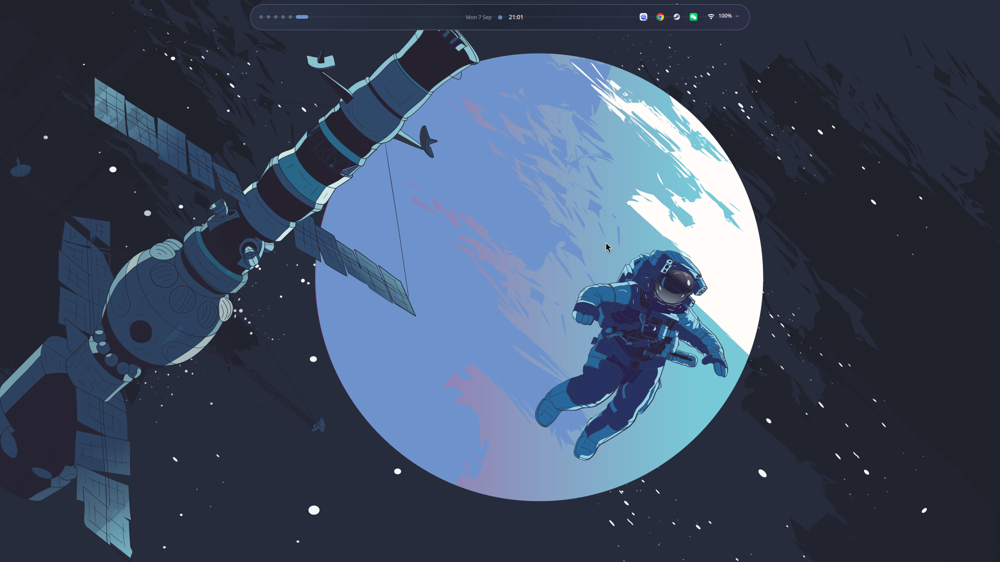
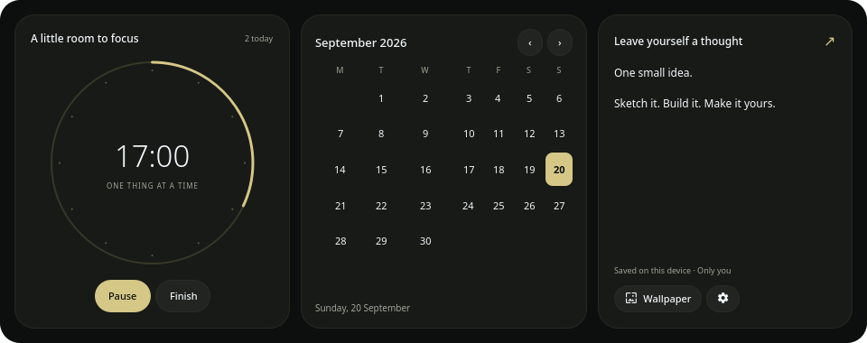
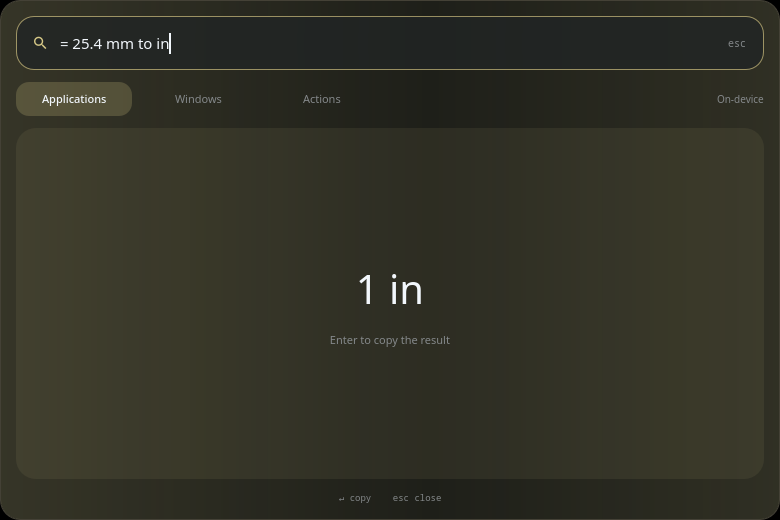
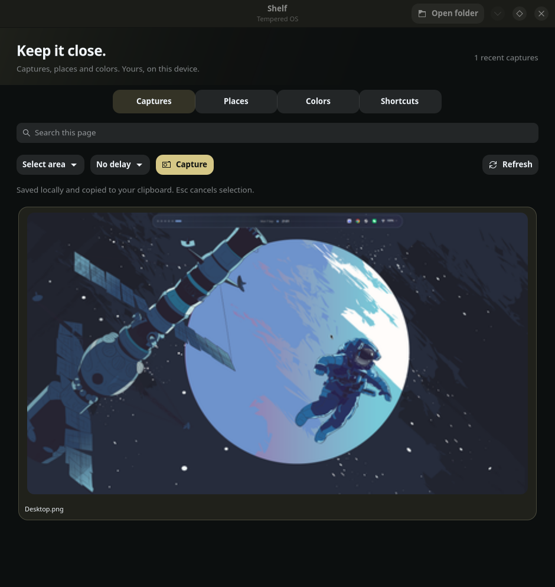
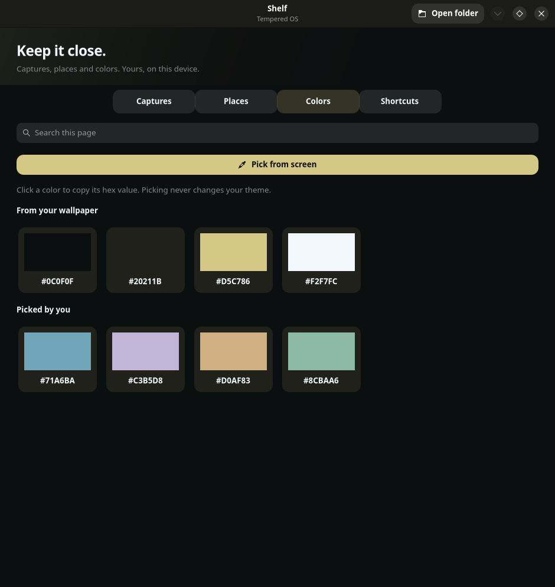
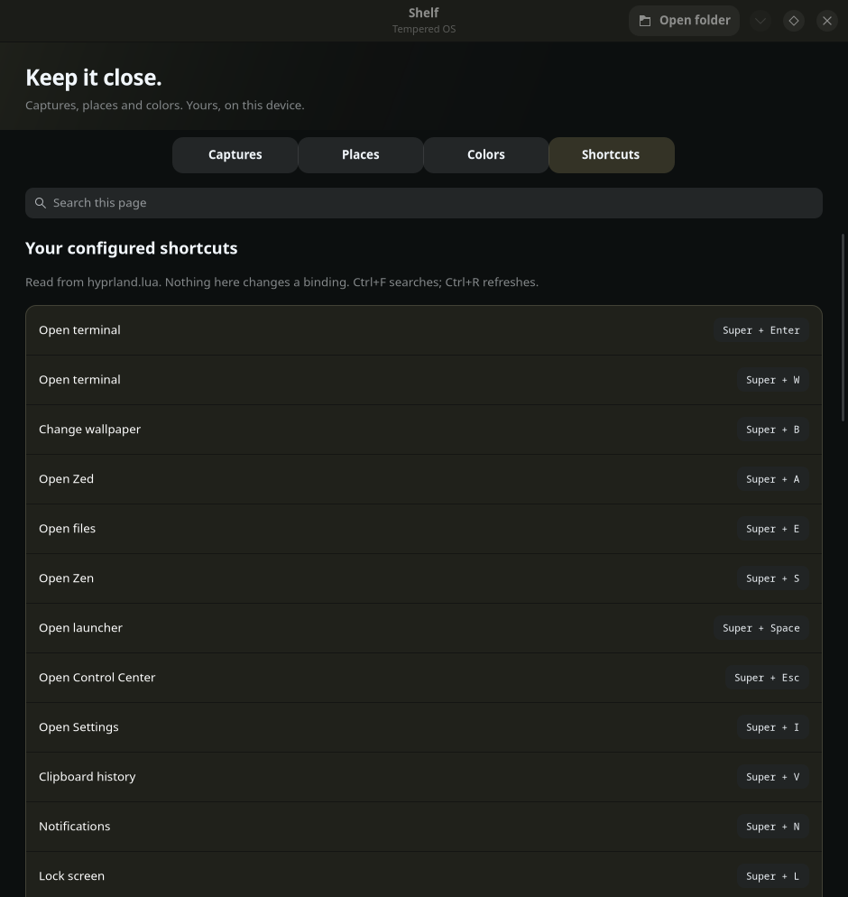

# Tempered OS

An adaptive, UX-first desktop layer for Arch Hyprland.



Tempered OS draws its color system from the current wallpaper using matugen, then carries
the material through its dynamic island, launcher, notifications,
terminal, lock screen, power surface, and settings. Acrylic is used 
as decoration over every pixel. Created by Codex.

## What makes it different

- Centered Control center / dynamic island with high functionality
- A Quickshell launcher and wallpaper browser, no rofi used
- A personal desk with a calendar, notes and a persistent focus timer
- Live audio controls, audio-reactive music bars and a workspace overview
- Launcher pins, recent apps, desktop actions and a local calculator
- Shelf: a screenshot library, pinned places, saved colouirs and a shortcut guide (kind of useless)
- Local unit conversions and calculator
- Settings App for appearance, island behavior, displays,
  sound routing, input, motion, networking, power, and accessibility
- Simple boot animation
- Hardware-safe installation that preserves the existing monitor arrangement

[What's new and how to use it](docs/desk-update.md)

[Shelf and everyday tools](docs/shelf-update.md)

## See the features

Focus timer, calendar and private notes.



Offline calculations and unit conversions, directly in the launcher.



<details>
<summary>Shelf: captures, colors and keyboard shortcuts</summary>

Choose an area, window or display, add a delay, and browse saved captures.



Pick screen colors, save them and copy their hex values.



Search your configured keyboard shortcuts.



</details>

The feature gallery shows the real interfaces with demonstration notes, colors and capture data.

## Installation 

```bash
git clone https://github.com/dsksnkz/TemperedOS.git
cd TemperedOS
./install.sh
```


## Shortcuts

- `Super + Space` — application current
- `Super + Esc` — dynamic island controls
- `Super + I` — Tempered OS Settings
- `Super + W` — Kitty terminal
- `Super + B` — wallpaper picker
- `Super + A` — Zed
- `Super + S` — Zen Browser
- `Super + Enter` — terminal
- `Super + E` — files
- `Super + Shift + S` — area capture
- `Super + Shift + P` — power surface

The wallpaper browser is adapted from
[Magetsu's QS Wallpaper Picker](https://github.com/magetsu002/qs-wallpaper-picker)
under its included MIT license.
