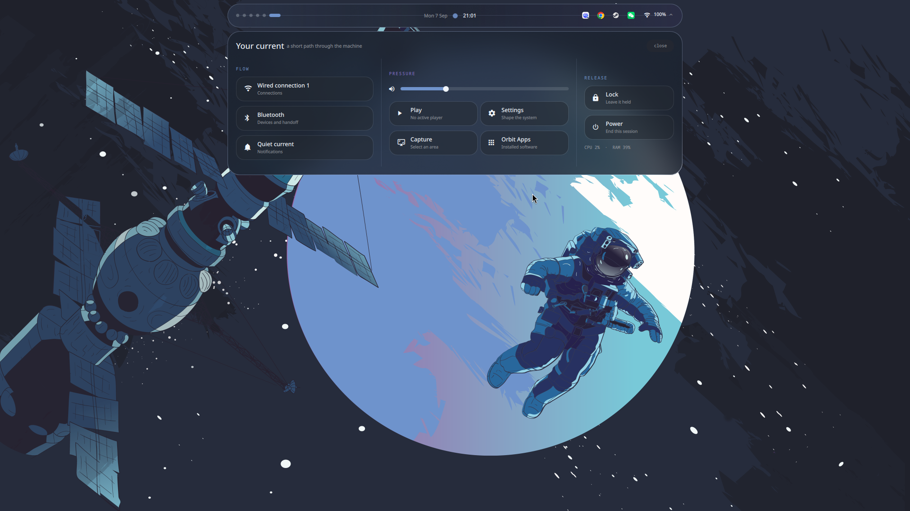

# Tempered OS

An adaptive, UX-first desktop layer for Arch Linux and Hyprland.


Tempered OS draws its color system from the current wallpaper, then carries
that material through its centered dynamic island, launcher, notifications,
terminal, lock screen, power surface, and settings. Acrylic is used for
context—not as decoration over every pixel.

## What makes it different

- A centered island occupying half the display instead of a full-width bar
- Dark wallpaper-derived surfaces with lively secondary accents and readable contrast
- A Quickshell launcher and wallpaper browser—no Rofi menu in the interaction path
- A connected “current” for workspaces, media, networking, sound and system load
- A personal desk with a calendar, private notes and a persistent focus timer
- Live audio controls, audio-reactive music bars and a workspace overview
- Launcher pins, recent apps, desktop actions and a local calculator
- Shelf: a screenshot library, pinned places, saved colors and a shortcut guide
- Offline unit conversions and area/window/display capture with optional delay
- A real settings application for appearance, island behavior, displays,
  sound routing, input, motion, networking, power, accessibility and privacy
- A short droplet boot handoff whose material comes from the wallpaper
- Hardware-safe installation that preserves the existing monitor arrangement
- Orbit Apps remains the installed-software manager

[What's new and how to use it](docs/desk-update.md)

[Shelf and everyday tools](docs/shelf-update.md)

## See the features

Focus timer, calendar and private notes.


Offline calculations and unit conversions, directly in the launcher.


<details>
<summary>Shelf: captures, colors and keyboard shortcuts</summary>

Choose an area, window or display, add a delay, and browse saved captures.


Pick screen colors, save them and copy their hex values.


Search your configured keyboard shortcuts.


</details>

The feature gallery shows the real interfaces with demonstration notes, colors and capture data.

<details>
<summary>See the island and Settings</summary>



</details>

## Install

```bash
git clone https://github.com/dsksnkz/TemperedOS.git
cd TemperedOS
./install.sh
```

The installer offers a timestamped backup before it changes managed desktop
files, preserves the active monitor arrangement, and installs the native tools
used by Settings. Use `./install.sh --no-packages` when dependencies are already
installed.

## Shortcuts

- `Super + Space` — application current
- `Super + Esc` — dynamic island controls
- `Super + I` — Tempered OS Settings
- `Super + W` — Kitty terminal
- `Super + B` — wallpaper picker
- `Super + A` — Zed
- `Super + S` — Zen Browser
- `Super + Enter` — terminal
- `Super + E` — files
- `Super + Shift + S` — area capture
- `Super + Shift + P` — power surface

The default wallpaper is only a starting point. Every wallpaper selection
redraws the shell palette immediately. The wallpaper browser is adapted from
[Magetsu's QS Wallpaper Picker](https://github.com/magetsu002/qs-wallpaper-picker)
under its included MIT license.
